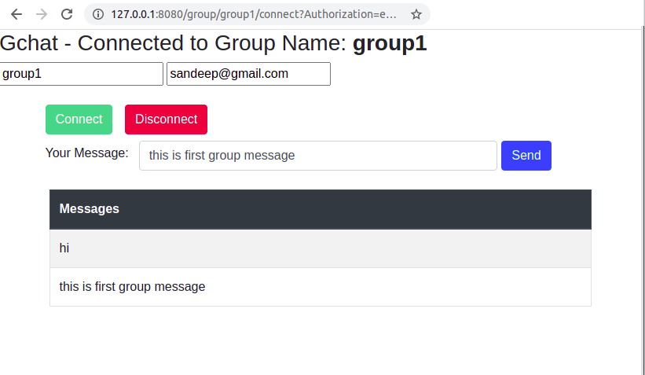
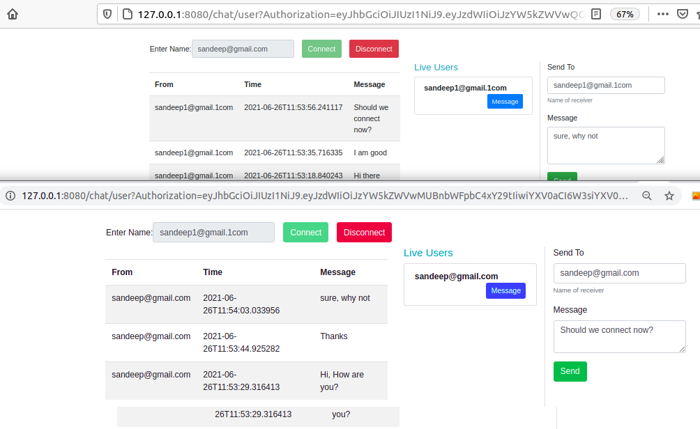

# **Content**
- [Problem statement](#problem-statement)
- [Features of demo chat application:](#features-of-demo-chat-application-)
- [In Scope](#in-scope)
- [Out of Scope](#out-of-scope)
- [Chat Application system design](#chat-application-system-design)
- [Demo Chat Application system design](#demo-chat-application-system-design)
- [Demo Chat Application - Group Chat screenshot](#demo-chat-application---group-chat-screenshot)
- [Demo Chat Application - One to one user chat screenshot](#demo-chat-application---one-to-one-user-chat-screenshot)
- [Demo Application functionality on AWS free tier](#demo-application-functionality-on-aws-free-tier)
- [Deployment Strategy](#deployment-strategy)
- [Demo deployment pointers on AWS free Tier](#demo-deployment-pointers-on-aws-free-tier)
----
# Problem statement
1. you should be able to do email login with social login
2. create, join or exit group
3. Send and receive messages to joined group
4. Send and receive messages to any valid user
5. Record user last seen message
6. Message message delivery receipt
7. Process message offline (send the message when user comes online)
8. report or analytics to find out top 10 popular groups (largest number of members of active users or highest chat messagee) (and order by it)

----
# Features of demo chat application:
1. Users can sign in with any email id or using social login (Social login is part of architecture but not functional due to SSL). Sign in for the first time will automatically do signup using the provided password.
2. It's a stateless application, using JWT token for every communication to identify the user. This app uses HTTP protocol for REST APIs and TCP used by websockets for server to client communication.
3. Users can sign in, can generate new JWT tokens and can check who I am.
4. Users can create, join, leave, and list the chat groups. Users can connect to any particular Group using websockets and start receiving all messages being sent to that group.
5. Users can do one to one chat. Users can send and receive messages from any other application user.
6. Once a message is delivered to the destination user, the delivery receipt is received automatically and then updates the message with delivery receipt.
7. Connection manager manages the websockets connection Id. Chat manager asks the connection manager for the websocket connection Id to deliver a message over TCP.
8. Connection managers add/remove user websocket connections when they connect or disconnect.
9. Message registry uses NoSQL database to store all the messages, this whole process is an asynchronous process.
10. Uuid manager provides a readily available list of uuids. It is used to simulate the  prefetching of a batch of uuid from the central uuid generator system. For every message, a new uuid is assigned from this system and then used throughout the application.
----
# In Scope
1. Email login and token based security.
2. Chat group management: create, join, leave and list my groups
3. Users can send messages to any specific user.
4. Users can join any group with a valid group name.
5. Users can receive messages from an online user.
6. Users can connect to the group and start receiving group messages.
7. User message delivery receipt acknowledgement flow and persist delivery date time for any message.
8. Handle messages for users which are offline and deliver when they are back online.
9. Websockets connections for message delivery.
10. NoSQL database storage.
11. Only text chat is supported. 
12. Security considerations involved for data, APIs, platform.
13. Basic validations and errors for inputs, authentication, data validity.
----
# Out of Scope
1. Social login
2. Users can’t send messages to users which are not registered users.
3. User' connection requests acceptance for sending messages.
4. No group invitations to join. 
5. Messages with assets are not supported like Images, audio, video and documents etc.
6. Message encryption and compression not included.
7. Priority message feature not supported.
8. Business process modeling (BPM) and workflow engines are out of scope.
9. Message forwarding, message reply is excluded.
----
# Chat Application system design

----
# Demo Chat Application system design

----
# Demo Chat Application - Group Chat screenshot

----
# Demo Chat Application - One to one user chat screenshot

----
# Demo Application functionality on AWS free tier
1. Home page will redirect to swagger ui. Do the sign in with the user sign API with any password and remember password for next time. Copy the JWT token.
2. In the Swagger top section, click the Authorize button and add JWT token, so swagger will send your JWT token for any further REST API call.
3. List, create or join any group.
4. To work with websockets for message delivery, 2 webpages are implemented for user to user chat and group chat.
5. Join any group using the following link and provide your JWT token. Replace groupName with valid group name which you have joined or created. You can also use my groups API to list your groups.
http://127.0.0.1:8080/group/{groupName}/connect?Authorization=XYZ
6. For user to user chat, use the following link. All online users will appear automatically and select any of the users to send messages.
http://127.0.0.1:8080/chat/user?Authorization=XYZ
----
# Deployment Strategy
1. Use CI/CD for the deployment process. Assuming we are using Kubernetes then use Jenkins X for deployment.
2. Source code should be on Git server. Use Git server webhooks for new code merge and trigger preview environment build automatically in Jenkins X. 
3. Source code can include Helm charts for automatically configuring the Kubernetes system and pods. Preview environments can include the installation of local db or some tools, but for production environments use dedicated tools/databases.
4. Source code should include unit tests and integration tests and run with all builds. For basic coding practices, SonarQube can also be integrated with Jenkins X.
5. Once the preview environment is deployed with a new version, then after verification that version can be deployed on the production environment.
6. For preview environments we can use a recreate strategy. For production environments use a/b testing strategy, it can be canary or blue/green based upon business requirement.
7. Istio can be used for traffic management, security and service mesh.
8. Grafana, Prometheus, Kiali, sentry, kibana can be used for monitoring and investigation purposes.
9. All machines, databases and services should run under VPC. Only the public facing applications should be exposed to connect from the outer world.
----
# Demo deployment pointers on AWS free Tier
1. Create ec2 instance, create and download .pem file. i am calling it gchat.pem
2. EC2 instance, open inbound and outbound connections for your sepecific IP or all public
3. Configure iptables, to accept traffic from 80 and 8080 port
	`iptables -A INPUT -i eth0 -p tcp --dport 80 -j ACCEPT`
	
	`iptables -A INPUT -i eth0 -p tcp --dport 8080 -j ACCEPT`
	
	`iptables -A PREROUTING -t nat -i eth0 -p tcp --dport 80 -j REDIRECT --to-port 8080`
4. Create postgres RDS instance and open inbound connection to be accessible from ec2. Create the database like gchat ro anything for this application.
5. Create dynamodb and add security group same to ec2, so access from ec2 machine
6. Create elastic search and kibana (refer AWS documentation). Not down the login credentials.
7. Create 3 tables in DynamoDb named usermessage (messageId as primary key), lastseen(userId as primary key, groupmessage (messageId as primary key)
8. From DynamoDb home page, enable DynamoDb stream so lambda function can read it.
9. Create a lambda function using blueprint DynamoDb streaming and modify to send that data to elastic search.
10. Create a AWS lambda expression (Node.js or Python)
11. Copy you jar/war file to ec2 machine like this:
`scp -i ~/gchat.pem /home/xxx/gchat-app/target/gchat-1.0.0.jar ec2-user@ec2-3-83-214-229.compute-1.amazonaws.com:/home/ec2`
12. Login to ec2 via command line
 `ssh -i "gchat.pem" ec2-user@ec2-3-83-214-229.compute-1.amazonaws.com`
13. Start java application like
 `sudo setsid java -jar -Dspring.profiles.active=prod gchat-1.0.0.jar &`
14. To deploy new code, find previous pid running of port and kill it

`	sudo ss -tulpn| grep :8080`	

    `kill -9 xxxx`
